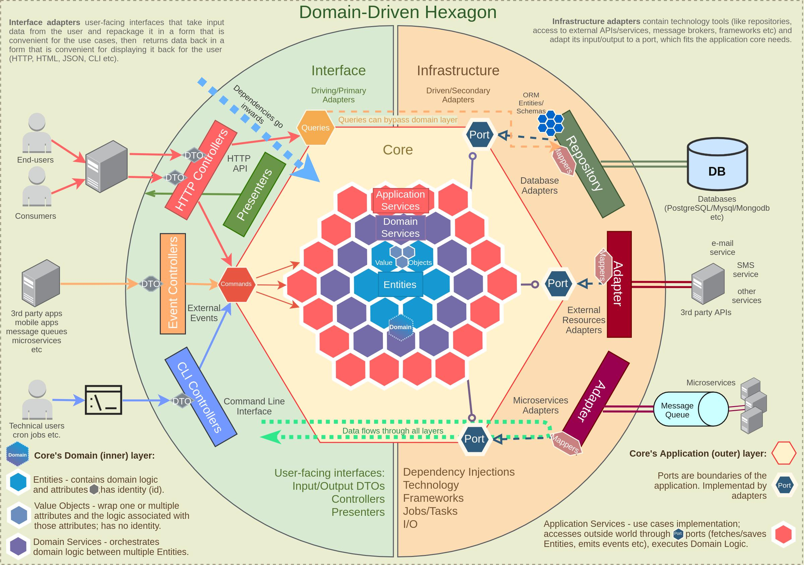

# NEO Starter - Domain Driven Design

### Motivation
>
You have a project / idea in your mind, and you're excited about it. You jump right into implementation, but soon realize it takes days if not weeks to only configure the basic things like linting, authentication, validation, etc. On top of that, you want to adhere to the best architectural practices making your codebase scalable from the start.

What if there was an easy boilerplate that uses the best practices from enterprise architecture while balancing the speed of development?
Meet Neo Starter DDD.

Neo Starter DDD is a boilerplate project that provides an easier and faster way to start a TypeScript project. It's a monorepo that focuses on a proper implementation of Clean Architecture and DDD, which is achieved by [truly] isolating Domain and Application layers. It also comes with some awesome out-of-the-box features (see `Backend Express` / `Frontend Next` sections below).

There are 2 distinct purposes for this boilerplate:
1) It provides a clear way to write a framework-free business logic for domain and application layers - thus making it able to reuse the code across frameworks and platforms.
2) So you can jumpstart a new project using Express.js and Next.js without spending weeks on the project configuration and some basic features.

### About Clean Architecture and Domain-Driven Design (DDD)

Clean architecture is a set of design principles that helps developers build software that is maintainable, testable, and adaptable.
[Learn more about Clean Architecture here.](https://blog.cleancoder.com/uncle-bob/2012/08/13/the-clean-architecture.html)

DDD is an approach of building your software based on the real-world business structure, which will operate this software. The main goal is to tackle complexity by breaking our potentially huge spagetti code into smaller "apps" or "sub-apps".
The best starting point for DDD is to [watch this video](https://www.youtube.com/watch?v=pMuiVlnGqjk). 



## Backend Express
An Express.js API server with all the pre-configured features & tools such as:
- DDD and Clean architecture
- Dependency injection
- ORM with PostgreSQL
- Seamless swagger and OpenAPI documentation
- User management
- JWT Authentication
- Zod Validation
- Logging
- Centralized error handling
- Request-logging
- Rate limitation
- Eslint + Prettier
- Integration tests with real Postgres database
- Standardized TypeScript config

You can easily switch the implementations by providing a different package to the DI container.

## Frontend Next
A Next.js app with pre-configured lint, tsconfig and Shadcn component library. It comes with a layout, home page, navigation and authentication wired up to call our backend service.

## Packages

A collection of monorepo packages that can be reused between apps. Also `domain` and `application` packages are where the actual business logic of our app sits (refering to the Clean Architecture). 

- `@neo/domain`: our domain aggregates are implemented here. This project has little dependency on anything else, and thus it's reusable between different frameworks and paradigms. It has zero ideas about what's going on outside of it, and this layer is activated by directly importing it and using it in the outer application layer.
- `@neo/application`: this layer invokes our domain logic and orchestrates how the data reaches our domain layer and how it's returned to the client. It uses its interface to tell the outer frameworks layer (apps essentially) what it needs in terms of the functionality and data, and those are injected.

### Other packages or features
- `@neo/eslint-config`: base `eslint` configuration for all our projects. It uses strict type-linting rules to autoformat and standardize the code.
- `@neo/typescript-config`: `tsconfig.json`s used throughout the monorepo.
- `@neo/common-entities`: Commonly used entities such as errors and response DTOs.
- `@neo/express-tools`: Reusable libraries for express server setup such as swagger & health-check routers, validation and logging.
- `@neo/persistence`: An infrastructure layer for implementing one or multiple database adapters.
- `@neo/security`: A few security services such as JWT and encryption used in authentication.


## Usage

### Build

To build all apps and packages, run the following command in the root directory:

```
npm run build
```

### Develop

To develop all apps and packages, run the following command:

```
npm run dev
```

### Test

To test all apps and packages:

```
npm run test
```

### Lint

To check for linting issues all apps and packages:

```
npm run lint
```
